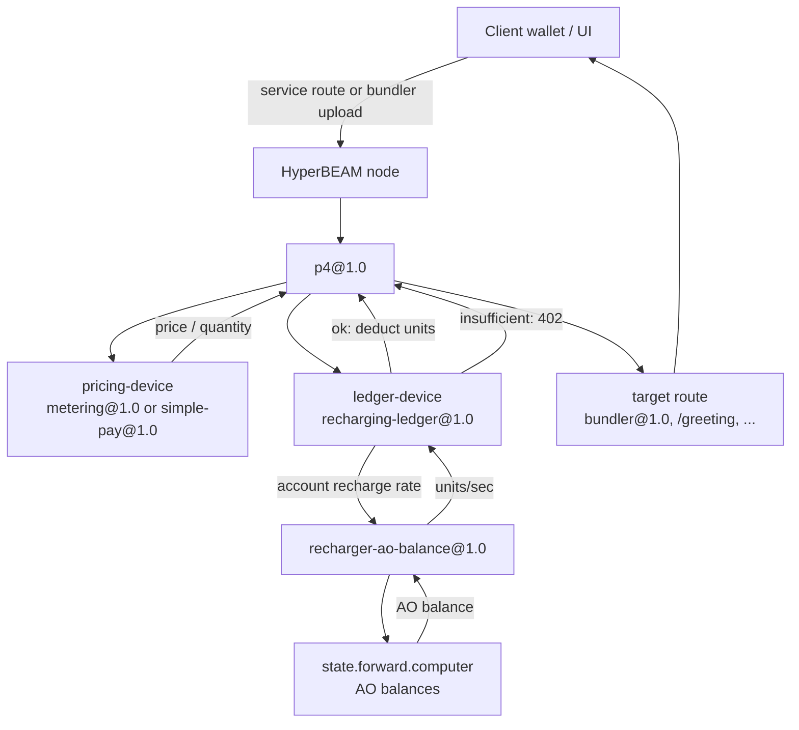

# recharger-ao-balance

AO-balance rate provider for `recharging-ledger@1.0`.

The ledger asks this device for an account's recharge rate. This device fetches
that account's AO balance and returns the effective recharge rate:

```text
base-rate + floor(balance / balance-step) * rate-step
```

The returned integer is the ledger's units-per-second recharge rate for that
account. AO balance changes refill speed only -- the ledger still owns capacity,
balance, and charging.



`recharging-ledger@1.0` uses the provider result as the account's recharge rate.
It does not add the ledger default recharge on top of it. Set `base-rate` to the
free baseline rate that every account should receive.

Default AO balance source:

```text
https://state.forward.computer/0syT13r0s0tgPmIed95bJnuSqaD29HQNN8D3ElLSrsc~process@1.0/compute/balances/<ACCOUNT>
```

Message keys:

```erlang
#{
    <<"device">> => <<"recharger-ao-balance@1.0">>,
    <<"base-rate">> => 1,
    <<"balance-step">> => 1_000_000_000_000,
    <<"rate-step">> => 1
}
```

with AO (denomination=12), that example means:

```text
0 AO -> 1 unit/sec
1 AO -> 2 units/sec
```

Build:

```sh
rebar3 compile
rebar3 device package
```

published device

```bash
device publish: recharger-ao-balance@1.0

spec=XzuSTJK0p3kZRFO2_a7GglmNgrZaNeZeWYT7yHZa0T4 

impl=UxHCrPcOowy9z3Bog1raz3Firu2wS4ppDt-4qVQUtY8 

signer=vZY2XY1RD9HIfWi8ift-1_DnHLDadZMWrufSh-_rKF0
```
